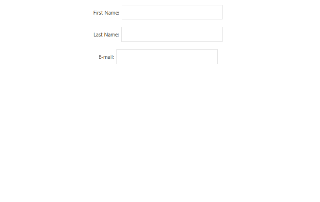

# keyboard-component (ReactJS)
This React keyboard component is simple yet useful for integrating into touch screen projects.

<h2>Demonstration</h2>

<h2>keyboard features</h2>

This document outlines the following features for the component:

- Automatically opening the keyboard when selecting an input text field.
- Caps-lock and Shift functionality to uppercase.
- Shortcuts for "@", ".com", and ".com.br".
- Ability to close the keyboard using the ESC key.

  
<h2>React Hooks</h2>
React Hooks usage of `useState`, `useEffect` and `useImperativeHandle`.